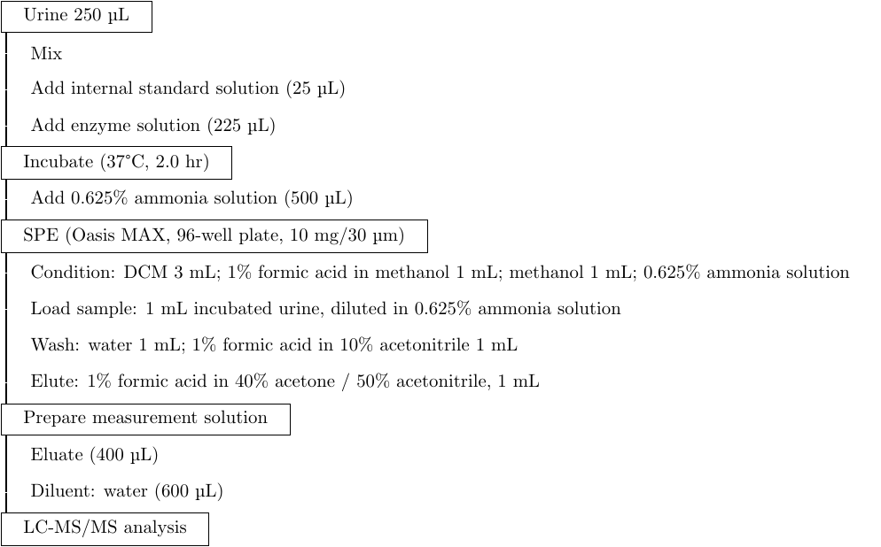

[← Index](index.md) | [← Chapter 5](chapter05_flowcharts.md) | [Next: Cookbook →](chapter07_cookbook.md)

# Chapter 6 — Templates

Four templates are built out so far — STROBE, CONSORT, PRISMA, and a left-aligned lab-protocol
style — covering the reporting-guideline flow diagrams clinical/health researchers need most
often, and a step-by-step method-diagram style relevant to any analytical or experimental field
(sample prep, synthesis routes, computational pipelines — anywhere a process has ordered stages
with sub-steps). The first three reuse exactly the primitives from Chapters 3–5
(`process`/`include`/`exclude` boxes, `arrow` edges, the trunk + side-branch layout); if your
field has its own named reporting standard with a required diagram, the same trunk-and-branch
pattern almost certainly applies — swap in your standard's stage names and you have a template.
The fourth (lab protocol) introduces a different visual family entirely (§4). Cohort, HBM,
risk-assessment, and DAG templates are listed at the end as not-yet-built — same process applies
whenever you get to them.

All four were verified by compiling them with the project's actual `tikzit.sty` +
`epiflow.tikzstyles` + `epiflow.tikzdefs` (the same wrapper Build/Preview generates), not just by
eyeballing the source.

## 1. STROBE — [`templates/strobe/strobe-template.tikz`](../templates/strobe/strobe-template.tikz)

For observational studies (cohort, case-control, cross-sectional). One trunk, two side branches —
the same shape as `first-flowchart.tikz` and `decision-example.tikz`, just with the diamond
replaced by a plain `process` box (STROBE doesn't call for an explicit eligibility *question*,
just a population count at each stage):

```
Source population assessed for eligibility (n=500)
        |                              \
        |                               -> Excluded (n=80)
        v                                   - Did not meet criteria (n=50)
Eligible cohort enrolled (n=420)               - Declined participation (n=30)
        |                              \
        |                               -> Lost to follow-up (n=35)
        v
Analyzed (n=385)
```

To adapt: edit the four numbers and the exclusion reasons (each reason is its own line inside the
`exclude` node's label, joined with `\\` — see Chapter 5's note on multi-line labels). Add more
trunk stages by repeating the `process`/`include` → `exclude` branch → next stage pattern.

## 2. CONSORT — [`templates/consort/consort-template.tikz`](../templates/consort/consort-template.tikz)

For randomized controlled trials. This is the first **multi-column** template — Chapter 5 §3's
pattern in practice: one shared trunk (`Assessed for eligibility` → `Randomized`), splitting into
two independent columns at the point of randomization, each column then running its own
trunk-plus-branch (`Allocated` → `Lost to follow-up` branch → `Analyzed`):

```
                 Assessed for eligibility (n=300) --> Excluded (n=50)
                                |
                          Randomized (n=250)
                       /                    \
   Allocated to intervention (n=125)   Allocated to control (n=125)
        |        \                         |        \
        |      Lost to follow-up (n=8)      |      Lost to follow-up (n=5)
        v                                   v
   Analyzed (n=117)                    Analyzed (n=120)
```

To adapt: this is also the template most likely to need a third or fourth arm (e.g. a dose-ranging
trial) — duplicate one column's three nodes (`Allocated`/`Lost to follow-up`/`Analyzed`) and its
edges, shift the x-coordinates to make room, and connect it from the `Randomized` node like the
other two.

## 3. PRISMA — [`templates/prisma/prisma-template.tikz`](../templates/prisma/prisma-template.tikz)

For systematic reviews/meta-analyses. Same single-trunk-with-branches shape as STROBE, just with
three stages instead of two (identification → screening → eligibility), matching PRISMA's
standard three-tier structure:

```
Records identified through database searching (n=500) --> Duplicates removed (n=50)
        |
Records screened (n=450) --------------------------------> Records excluded (n=300)
        |
Full-text articles assessed for eligibility (n=150) -----> Full-text articles excluded (n=100)
        |
Studies included in qualitative synthesis (n=50)
```

To adapt for the full PRISMA 2020 checklist (which also tracks records from registers vs.
databases separately, and may add a "studies included in quantitative synthesis / meta-analysis"
final stage), add another parallel trunk at the identification stage, or another final-stage box
with its own incoming edge from the last `process` node.

## 4. Lab protocol — [`templates/lab_protocol/lab-protocol-template.tikz`](../templates/lab_protocol/lab-protocol-template.tikz)

For step-by-step analytical/sample-prep methods (e.g. an LC-MS/MS extraction protocol) — common
in method papers, but a visually different family from the box-and-arrow diagrams above: a single
continuous vertical line down the left margin, with bordered **stage** boxes (major steps) and
unboxed, indented **substep** text (the details under each stage) hanging off it. No arrowheads.



Four new styles in [`epiflow.tikzstyles`](../epiflow.tikzstyles) make this work:

```latex
\tikzstyle{stage}=[draw=black, fill=white, rectangle, align=left, anchor=west, inner sep=4pt, inner xsep=12pt]
\tikzstyle{substep}=[draw=none, rectangle, align=left, anchor=west, inner sep=4pt, inner xsep=16pt]
\tikzstyle{spine}=[-, thick]
\tikzstyle{spinepoint}=[draw=none, fill=none, inner sep=0pt, minimum width=0pt, minimum height=0pt]
```

The mechanism worth understanding before adapting this one — it's the first template using it,
and it went through a couple of real iterations to get right:

- **`anchor=west`** on `stage`/`substep` means the coordinate you give a node (`at (0, -2.1)`) *is*
  that node's west (middle-left) point, not its center. Every visible stage and substep here is
  placed at the same `x=0`, so all their west points line up in one column regardless of how wide
  each box's text makes it.
- **`substep`'s `inner xsep=16pt`** pads the *inside* of the (invisible, `draw=none`) box before
  the text starts — shifting the visible text right without moving the node's actual anchor
  point. That's what creates the indent under each stage without breaking the alignment above.
  `stage`'s smaller `inner xsep=12pt` does the same for the bordered boxes, leaving enough room
  between the border and the text for the connecting line to pass underneath both without
  touching either.
- **The connecting line does not connect to the visible nodes at all.** Each visible row has a
  matching invisible `spinepoint` node at `x=0.1` (aligned with the row's `y`), and the `spine`
  edges connect *those* — `(15) to (16)`, `(16) to (17)`, etc. This was necessary because
  TikZiT's edge format only connects to named nodes — no raw coordinates, no `calc`-style
  `[xshift=...]` syntax (either would make the file unreadable by the GUI) — so decoupling the
  line's x-position from the boxes' required a second, invisible set of nodes to anchor it to.
- **The line is drawn *behind* the stage boxes, not just beside them.** This needs two things
  together: `stage` has an opaque `fill=white` (boxes were originally transparent, so "behind"
  and "in front" looked identical — the line showed through either way); and, more
  fundamentally, the spine's `\draw` commands had to move out of `edgelayer` entirely. The
  project's `\pgfsetlayers{nodelayer,edgelayer}` (set in `tikzit.sty`, used by every other
  template) always draws all of `edgelayer` after all of `nodelayer`, regardless of where each
  block physically sits in the file — so as long as the spine lived in `edgelayer`, no amount of
  reordering would put it under the boxes. The fix: this file's spine `\draw`s, the `spinepoint`
  nodes, *and* the visible `stage`/`substep` nodes are all written inside one single
  `pgfonlayer{nodelayer}` block, in that literal order — spinepoints, then the line, then the
  boxes last. Within one layer, paint order follows source order, so the boxes (drawn last) cover
  the line wherever they overlap it. This file doesn't use `edgelayer` at all.
- This template is the one most worth hand-editing in the text editor rather than the canvas —
  the 15 invisible `spinepoint` nodes clutter the GUI view, the mouse-driven Edge tool has no way
  to target them precisely, and the deliberate single-layer / draw-order structure is exactly the
  kind of thing a GUI "save" might flatten back into the usual two-block convention and undo.

To adapt: add or remove stage/substep nodes, add a matching `spinepoint` node at the same `y` for
each new row, and extend the chain of `spine` edges between consecutive `spinepoint` nodes —
keeping all three (spinepoints, spine edges, visible nodes, in that order) inside the same
`nodelayer` block. The y-coordinates here are manually spaced (`-0.7` per row) rather than
auto-flowing — widen those gaps (on both the visible node and its `spinepoint` partner) if a
label wraps onto two lines.

## Not yet built

These template folders exist as placeholders for now — same process as above when you get there:

- [`templates/cohort/`](../templates/cohort/) — cohort attrition / follow-up-over-time diagrams
- [`templates/hbm/`](../templates/hbm/) — Health Belief Model conceptual diagrams
- [`templates/risk_assessment/`](../templates/risk_assessment/) — risk assessment / decision trees
- [`templates/dag/`](../templates/dag/) — causal diagrams (DAGs) for confounding/bias discussions

[Next: Chapter 7 — Cookbook →](chapter07_cookbook.md)
