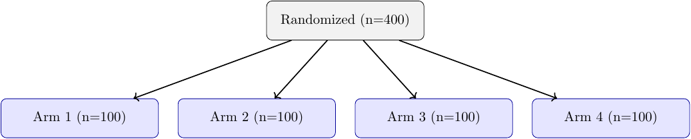
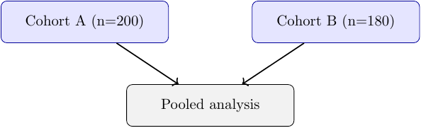
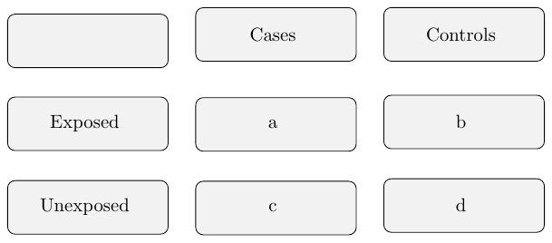
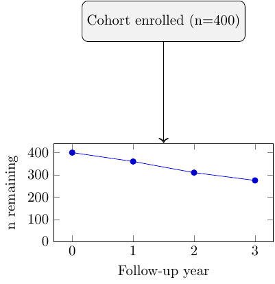

[← Index](index.md) | [← Chapter 7](chapter07_cookbook.md) | [Next: Troubleshooting →](chapter09_troubleshooting.md)

# Chapter 8 — Advanced TikZ

Everything so far stays inside what TikZiT's GUI can parse and redraw: literal nodes, literal
edges, no macros. This chapter is the opposite — techniques that only make sense hand-authored
directly in a `.tex`/`.tikz` file, because the GUI's grammar has no concept of a loop, a computed
coordinate, or a grid. **None of the four examples below should be expected to open cleanly in
TikZiT's TikZ Editor** — they use `\foreach`, `($...$)` calc expressions, `\matrix`, and
`\begin{axis}`, none of which appear in the node/edge grammar the GUI parses. Write and edit these
in a plain text/code editor, and use Chapter 7's `pdflatex`-based workflow (or
`scripts/build-all.sh`) to see them, not Build/Preview's GUI-integrated commands.

All four were compiled and rendered while writing this chapter — see
[`examples/figures/`](../examples/figures/) for the source and [`images/`](../images/) for the
output.

## A real bug this chapter surfaced — and a project-wide fix

Building the `pgfplots` example below (§4) turned up something that would have silently broken
any future figure combining a third-party drawing package with this project's TikZiT setup:
`tikzit.sty`'s `\pgfsetlayers{nodelayer,edgelayer}` does not include pgf's own default layer,
called `main`. Anything drawn *outside* an explicit `\begin{pgfonlayer}{...}` block — which
includes `\foreach`/`\matrix` content if you forget to wrap it, and pgfplots' `axis` environment
internally — gets silently dropped. No error, no warning: the page just renders without that
content. Confirmed in isolation, with no TikZiT involvement at all: the exact same `pgfplots`
figure rendered nothing with `\pgfsetlayers{nodelayer,edgelayer}` and rendered correctly with
`\pgfsetlayers{main,nodelayer,edgelayer}`.

[`tikzit.sty`](../tikzit.sty) in this repo now includes `main` in that list. This was checked
against every existing template and example (`scripts/build-all.sh`, byte-for-byte PNG comparison
before/after) — identical output, no regressions, since all of this project's own content was
already explicitly wrapped in `nodelayer`/`edgelayer`. If you copy this project's `tikzit.sty`
into another project, make sure it has `main` in the layer list too.

## 1. TikZ libraries worth knowing

Beyond `arrows.meta` and `shapes.geometric` (Chapters 4–5), four more come up constantly once
you're hand-editing:

| Library | What it adds | Used in |
|---|---|---|
| `positioning` | Relative placement keywords (`right=2cm of foo`) | Loaded in `researchflow.tikzdefs`, not yet exercised by a template |
| `calc` | `($...$)` arithmetic on coordinates — midpoints, offsets | §2 below |
| `matrix` | `\matrix [matrix of nodes]` — grid layouts without manual coordinates | §3 below |
| `decorations.pathreplacing` | Brace/bracket decorations along a path (e.g. annotating a span of boxes) | Not yet used in this project |

All of these are added via `\usetikzlibrary{...}` in [`researchflow.tikzdefs`](../researchflow.tikzdefs) —
the same mechanism Chapter 5 used for `shapes.geometric`. `pgfplots` (§4) is a full package, not a
TikZ library, so it needs `\usepackage{pgfplots}` instead; `researchflow.tikzdefs` can hold that too,
since the extension just `\input`s its contents as raw preamble code.

## 2. `\foreach` for repetitive structures

[`examples/figures/advanced-foreach.tikz`](../examples/figures/advanced-foreach.tikz) — a 4-arm
trial allocation, generated rather than hand-placed:

```latex
\foreach \i [count=\n from 0] in {1,2,3,4} {
    \node [style=include] (arm\i) at (\n*4.5 - 6.75, -2.5) {Arm \i{} (n=100)};
}
```



Two things worth knowing if you write one of these:

- **`[count=\n from 0]`** gives you a separate zero-based counter (`\n`) alongside the loop
  variable (`\i`), useful for arithmetic (spacing nodes evenly) when the loop values themselves
  aren't plain integers you can compute with directly.
- **`\i{}` , not `\i`, before a space.** `\i` is a TeX control word (made of letters); TeX
  consumes the space after a control word as part of invoking it, not as a literal space in the
  output. Without the empty group, `Arm \i (n=100)` renders as `Arm 1(n=100)` — silently missing
  a space, no error. This is a general TeX gotcha, not specific to `\foreach`, but it's exactly
  the kind of thing that's easy to miss when a macro's expansion is sitting next to ordinary text.

The corresponding `\draw` loop must live in `edgelayer` separately, same two-block convention as
everywhere else in this project:

```latex
\foreach \i in {1,2,3,4} {
    \draw [style=arrow] (r) to (arm\i);
}
```

## 3. `calc` for computed coordinates

[`examples/figures/advanced-calc.tikz`](../examples/figures/advanced-calc.tikz) — placing a node
exactly at the midpoint between two others, then offset below them:

```latex
\node [style=process] (mid) at ($(a)!0.5!(b) + (0,-2)$) {Pooled analysis};
```



`(a)!0.5!(b)` is calc's "partway" syntax — `0.5` for the midpoint, `0.25` for a point a quarter of
the way from `a` to `b`, etc. Adding `+ (0,-2)` shifts that point down. The practical case this
solves: positioning a node that depends on *two* other nodes' positions, where guessing a fixed
coordinate would break the moment either source node moved. This is also exactly the kind of
coordinate arithmetic `($...$)` syntax that Chapter 6 noted TikZiT's edge/node grammar does **not**
support — confirmation that this is hand-authored-only territory.

## 4. `matrix` for grid layouts

[`examples/figures/advanced-matrix.tikz`](../examples/figures/advanced-matrix.tikz) — a 2×2
exposure/outcome contingency table, the kind of grid that's tedious to lay out node-by-node with
manual coordinates:

```latex
\matrix [matrix of nodes, nodes={style=process, minimum width=3cm}, row sep=0.5cm, column sep=0.5cm] {
    {} & Cases & Controls \\
    Exposed & a & b \\
    Unexposed & c & d \\
};
```



`nodes={style=...}` applies one style to every cell; rows are separated by `\\`, columns by `&`,
exactly like a LaTeX `tabular`. The empty `{}` first cell is required — `matrix` needs every row
to have the same number of `&`-separated entries, including blank corner cells.

## 5. `pgfplots` for combined diagram + chart figures

[`examples/figures/advanced-pgfplots.tikz`](../examples/figures/advanced-pgfplots.tikz) — a flow
node feeding into a real data plot, both in one `tikzpicture`:

```latex
\begin{axis}[
    at={(0,-4)}, anchor=north,
    width=7cm, height=4cm,
    xlabel={Follow-up year}, ylabel={n remaining},
    ymin=0,
]
    \addplot coordinates {(0,400) (1,360) (2,310) (3,275)};
\end{axis}
```



`at={(0,-4)}, anchor=north` positions the axis the same way you'd position a node — by giving the
coordinate of one of its anchor points. Useful when a figure needs to *show* attrition
numerically (a real declining-n chart) right below the flowchart that describes it qualitatively,
without switching to a separate figure environment. Remember the fix from this chapter's opening
section: this only renders because `tikzit.sty` includes `main` in its layer list — without that,
the `axis` content silently vanishes, exactly as it did during testing.

[Next: Chapter 9 — Troubleshooting →](chapter09_troubleshooting.md)
